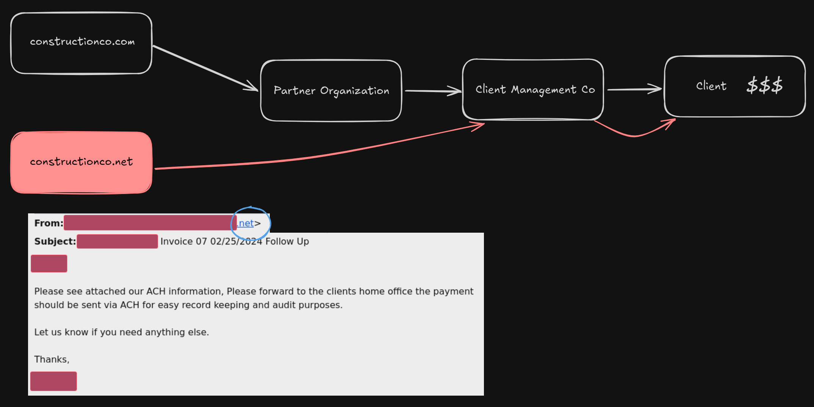

+++
title = 'Domain Squatting, BEC, Fake Invoices...oh my'
date = "2025-09-09T10:00:00-07:00"
draft = false
tags = ["cybersecurity", "phishing", "domain-security"]
+++

About a year ago I had a friend call me with a minor concern. They worked for a
reputable general contractor that worked with some very high-end clients.
Incredibly wealthy is what that means. They were wondering how an email could
appear to have come from one of the managers of the company requesting payment
from a client. This piqued my interest. Honestly I had a hard time wrapping my
head around the circumstances, as the timeline was not explained well. I will
attempt to do a better job explaining it below:

