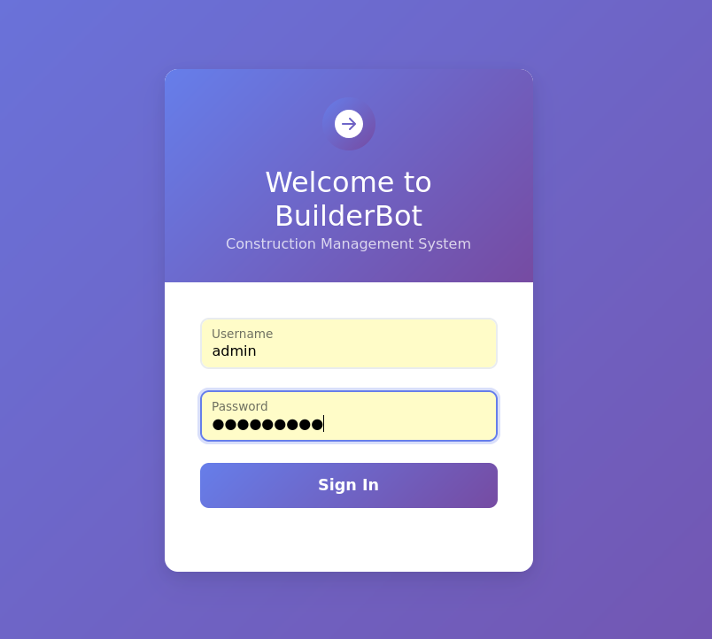
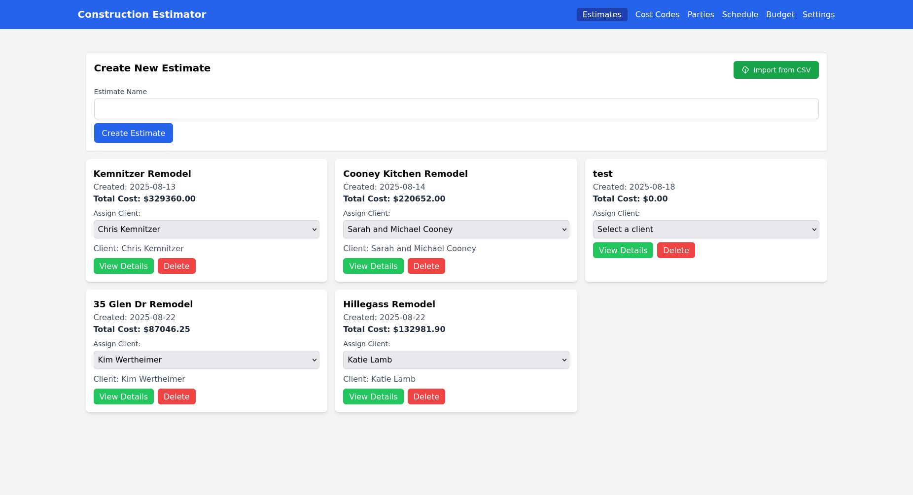

+++
date = '2025-08-29T10:43:39-07:00'
draft = true
title = 'Project Managment Platform'
+++

We needed a project management platform. So I built one.

Here is the login page:

This is the landing page that offers us a look at all the estimates we are working with. This differs from most
platforms in that this is a fluid page that encompasses all data for every potential or active engagemtn we have.

